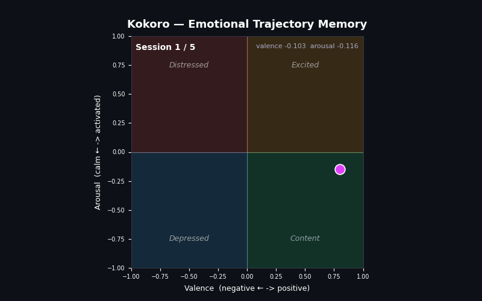

# Kokoro 心

**Emotional trajectory memory for AI companions.**

Kokoro is a memory layer that tracks how a user has been feeling across conversations — not just what they said. It gives your AI companion a sense of the person's emotional history, so responses feel like they come from something that actually knows them.

Most companion systems remember facts. Kokoro remembers how someone has been doing.

---



_A user's emotional state vector moving through Russell's circumplex space across five sessions of gradual burnout. Each dot is a session. The trail is the trajectory Kokoro tracks._

---

## The problem

Every AI companion today resets emotionally at the start of each conversation. It might remember that you have a dog named Bruno or that you work in finance. It does not know that you have been grinding through burnout for three weeks, that last Tuesday felt like a turning point, or that your message today — "still here lol" — carries more weight than it looks like.

---

## A different approach

Every existing system treats emotional memory as a lookup problem. You have a conversation, you extract emotional facts, you store them, you retrieve them when relevant. The emotion is a label attached to a memory.

Kokoro treats emotional state as an environment that evolves according to dynamics. The transition model does not ask "what emotion did the user express today." It asks "given the current state of this user's emotional world and what just happened, what is the new state." That is a fundamentally different question.

The difference in practice: a lookup system knows you were anxious on April 18. A world model knows you have been in a high-arousal negative state for three weeks and the trajectory suggests you are slowly moving toward lower arousal — which is either recovery or depression depending on valence. That is not stored anywhere. It emerges from the learned dynamics.

---

## How it works

- **Each session gets encoded.** When a conversation ends, Kokoro encodes the full session into a 384-dimensional embedding and runs it through a learned transition model that updates a continuous state vector — a compressed representation of the user's recent emotional trajectory.

- **The state is decoded into emotional coordinates.** A linear probe maps the state vector to valence (positive/negative affect) and arousal (activated/calm), then generates a plain-English summary of the trajectory — stable, improving, declining, and why.

- **Retrieval is emotionally weighted.** When the user sends a new message, Kokoro retrieves relevant past sessions using a hybrid of semantic similarity (what matches the topic) and emotional similarity (what matches how they are feeling now). The default blend is 60% semantic / 40% emotional.

---

## Quickstart

```bash
pip install kokoro
```

```python
from kokoro import WorldMemory

memory = WorldMemory(user_id="alice")

# At the end of each conversation session
memory.update(session_turns)

# Before each LLM reply
context = memory.get_context(user_message)

# Use it
response = llm(
    system=context["state_summary"],
    memories=context["relevant_memories"],
    message=user_message,
)
```

`session_turns` is a list of `{"role": "user"|"assistant", "content": "..."}` dicts — the same format as OpenAI and Anthropic chat messages.

---

## What `get_context()` returns

```python
context = memory.get_context("still here lol")

{
    "state_summary":      "User has been trending negatively across recent sessions, "
                          "with affect noticeably declining and low energy levels.",
    "relevant_memories":  [
        "finished the sprint but honestly just feel empty. not relieved, just empty. "
        "i used to love coding. now i just stare at the screen.",
        "missed a deadline for the first time in like two years. just couldn't focus. "
        "kept starting things and not finishing. my brain feels scattered.",
        "snapped at a junior dev today for something stupid. felt awful after.",
    ],
    "valence":            -0.134,
    "arousal":            -0.008,
    "trend":              "declining",
    "trend_strength":     0.031,
    "session_count":      5,
    "ready":              True,
}
```

You inject `state_summary` and `relevant_memories` into your system prompt. The LLM does the rest.

> **Note:** `state_summary` is `None` for the first two sessions (warm-up period) and its quality depends on conversation style — it is more reliable for emotionally expressive conversations than short or technical ones.

---

## Examples

| File                                                                   | What it shows                                                                                    |
| ---------------------------------------------------------------------- | ------------------------------------------------------------------------------------------------ |
| [examples/basic_usage.py](examples/basic_usage.py)                     | Full end-to-end example with no API key — mock LLM response, all steps commented                 |
| [examples/with_openai.py](examples/with_openai.py)                     | Real integration with OpenAI or any OpenAI-compatible API (Groq, Together, etc.)                 |
| [examples/with_custom_retrieval.py](examples/with_custom_retrieval.py) | Pluggable `retrieval_fn` — replace ChromaDB with Pinecone, pgvector, Qdrant, or any vector store |

---

## Bring your own vector database

If you already have a vector store, replace Kokoro's built-in ChromaDB retrieval entirely. Kokoro still handles state tracking, transition, and decoding. You handle storage and retrieval.

```python
def my_retrieval(user_id, query_embedding, state_vector, top_k):
    results = my_vector_db.search(query_embedding, top_k)
    return [{"session_text": r.text, "session_id": r.id} for r in results]

memory = WorldMemory(user_id="alice", retrieval_fn=my_retrieval)
```

Your function receives both the query embedding (semantic axis) and the current emotional state vector (emotional axis), so you can implement your own hybrid scoring if you want to.

---

## Under the hood

| Component         | What it does                                                                                                                                                                      |
| ----------------- | --------------------------------------------------------------------------------------------------------------------------------------------------------------------------------- |
| `SessionEncoder`  | Encodes a conversation session into a 384-dim vector using `all-MiniLM-L6-v2`. User turns are weighted 2× over assistant turns.                                                   |
| `TransitionModel` | A 591k-parameter MLP that takes the current state vector and the session embedding and outputs a new L2-normalized state. Trained on 10,000 synthetic emotional arc trajectories. |
| `StateDecoder`    | A linear probe that maps the state vector to valence and arousal, computes trend from arc history slope, and generates a plain-English summary.                                   |
| `StateStore`      | SQLite. Persists the state vector, valence, arousal, and arc history per user. Fast, local, zero configuration.                                                                   |
| `MemoryStore`     | ChromaDB. Stores session embeddings. Retrieval blends semantic similarity on the query embedding and emotional similarity on the state vector.                                    |

---

## Research

Kokoro is based on a research project investigating continuous emotional state tracking for AI companions. The transition model is grounded in Russell's circumplex model of affect (1980) and trained on synthetic multi-session trajectories derived from EmpatheticDialogues (Rashkin et al., 2019).

Key results:

- **197% improvement** in arc separation over a last-session embedding baseline
- **r = 0.765** valence decodability from state vectors via linear probe
- **Generalizes to real data** — validated on the Multi-Session Chat dataset (Xu et al., 2022), never seen during training
- **Emotional retrieval surfaces different memories** than semantic-only retrieval in the majority of tested scenarios

The probe is validated on synthetic data. Downstream evaluation on naturalistic companion conversations is ongoing. A companion paper is in preparation.

---

## Limitations

- **Warm-up period.** Emotional context is not injected until 3 sessions have been logged. New users start cold.
- **State space is primarily valence-tracking.** The model is better at detecting sustained negative or positive states than precise arousal levels or nuanced emotional distinctions.
- **Probe accuracy depends on conversation style.** Very short sessions, non-emotional topics, or conversations dominated by assistant turns produce weaker signal.
- **Local storage only.** State is stored in SQLite and ChromaDB on disk. No built-in cloud sync — use `retrieval_fn` to connect an external store.

---

## Requirements

- Python 3.10+
- `torch >= 2.2.0`
- `sentence-transformers >= 2.7.0`
- `numpy >= 1.26.0`
- `chromadb >= 0.5.0`

Optional:

- `openai >= 1.0.0` — for `examples/with_openai.py`
- `groq >= 0.4.0` — for running the downstream evaluation experiment

---

## Citation

```bibtex
@misc{kokoro2026,
  title   = {Kokoro: Emotional Trajectory Memory for AI Companions},
  author  = {Myakeri, Dhruva},
  year    = {2026},
  note    = {Paper in preparation},
  url     = {https://github.com/DhruvaMyakeri/kokoro},
}
```

---

## License

MIT
